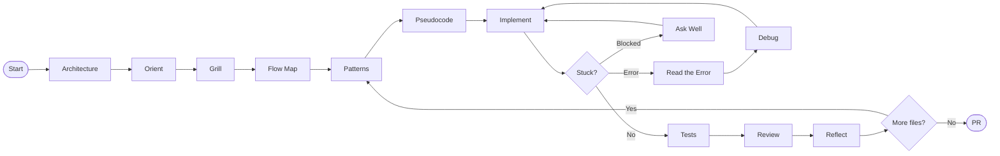

# groundup

A Claude Code framework for junior engineers who want to actually get better — not just ship features.

groundup makes Claude act as a senior engineer mentor who refuses to do the thinking for you. It enforces a structured workflow that builds real engineering skills: system design, debugging, pattern recognition, and code review.

> The feature is a vehicle. The goal is the engineer who can build the next one independently.

---

## What It Does

Every session follows a deliberate sequence:



**Architecture** — In a brownfield or unfamiliar codebase, Claude reads the system design and produces a Mermaid diagram showing layers, services, and dependency direction. Then interrogates you on *why* it is shaped that way — not just what it does.

**Orient** — After architecture, traces one real user journey hop-by-hop through the codebase with file and line references. Locates exactly where your change fits and names anything unknown as an explicit assumption.

**Grill** — Before any code, Claude interviews you relentlessly until you can state the approach, the affected files, and the key edge cases. One question at a time. No answer given until you've reasoned through it.

**Flow Map** — You draw the data flow. Claude interrogates it: transaction boundaries, failure modes, ownership, synchronous vs async. Both of you sign off on the diagram before any file is touched.

**Patterns** — Before you commit to a design or write a function, Claude checks: does this step have a known industry pattern? If yes, you learn it now — not in code review after you've already implemented something else.

**Pseudocode** — Claude writes the pseudocode directly into the file. Problem-domain language, not code. You have to think about how to translate it. That translation is where the skill gets built.

**Implement** — You write the code. Syntax help only if you ask, and only one targeted example.

**Read the Error** — When a test fails or an error is thrown, three gates before any debugging or Googling: what is the error type, what line is it pointing to, what is your hypothesis from the message alone.

**Debug** — When you're stuck, Claude doesn't suggest fixes. It walks you through: reproduce → hypothesise → instrument → verify. No fix without a stated root cause.

**Ask Well** — When you're about to ask a question — mid-session or externally — Claude structures it first: what you're trying to do, what you've tried, what you expected vs what happened, where specifically you're stuck. A well-formed question is already 50% of the answer.

**Review** — Per-file code review once tests exist. Edge cases from the pseudocode header must be covered.

**Reflect** — One targeted question after each file. Not a quiz — a question that builds the instinct for next time. Claude doesn't give the answer.

---

## Install

```bash
claude plugin install https://github.com/Osireg17/groundup
```

That's it. Open Claude Code in any project and start describing what you want to build.

**Optional team configuration:** Add a `.grounduprc.md` to your project root to inject team-specific patterns, codebase context, and junior traps. Copy `docs/grounduprc-template.md` from this repo as a starting point. The mentor reads it at session start and applies it alongside the global rules. Commit it so all team members share the same configuration.

**Requirements:** Claude Code (CLI or IDE extension)

**Optional:** [GSD](https://github.com/gsd-build/get-shit-done) — if installed, groundup integrates with `/gsd-ship` for final review and PR creation.

---

## Update

```bash
claude plugin update groundup
```

groundup pulls the latest version from GitHub automatically. Run this on any machine where you have it installed — personal laptop, work laptop, anywhere.

---

## Uninstall

```bash
claude plugin uninstall groundup
```

---

## How It Works

groundup is a Claude Code plugin. Installing it adds:

- **Skills** — invokable via `/groundup:<skill>`: `architecture`, `orient`, `grill`, `flow-map`, `pseudocode`, `systematic-debugging`, `read-the-error`, `patterns`, `growth-review`, `ask-well`
- **Bootstrap** — a `SessionStart` hook that loads the `using-groundup` skill at the start of every session, activating the mentor persona automatically
- **Mentor persona** — defined in `CLAUDE.md`, loaded via the bootstrap hook into every session

Skills are triggered automatically (with a nudge, not a hard block) when a gate is bypassed. They can also be invoked manually with `/groundup:<skill-name>`.

---

## The Approach

groundup doesn't hard-block you. If you skip the grill or skip the flow map, Claude names the skip and the risk, then continues. The skip is itself a learning moment.

This is a deliberate choice. Engineers who learn to recognise *when* to invoke the process — not just follow it — develop better judgment than engineers who are forced through gates they don't understand.

---

## File Structure

```
groundup/
├── .claude-plugin/
│   └── plugin.json                  # Plugin manifest (name, version, metadata)
│
├── CLAUDE.md                        # Mentor persona — loaded into every session via hook
├── PHILOSOPHY.md                    # Why this framework exists
├── install.sh                       # Runs: claude plugin install
├── update.sh                        # Runs: claude plugin update groundup
├── uninstall.sh                     # Runs: claude plugin uninstall groundup
│
├── skills/
│   ├── using-groundup/SKILL.md      # Bootstrap: skill map, iron laws, trigger rules
│   ├── architecture/SKILL.md        # System design reading + Mermaid diagram
│   ├── orient/SKILL.md              # Trace a user journey to locate the change
│   ├── grill/SKILL.md               # Design interview
│   ├── flow-map/SKILL.md            # Data flow discussion
│   ├── pseudocode/SKILL.md          # Problem-domain pseudocode in file
│   ├── systematic-debugging/SKILL.md # Root cause first
│   ├── read-the-error/SKILL.md      # Three gates before debugging a failing test
│   ├── patterns/SKILL.md            # Contextual pattern teaching
│   ├── growth-review/SKILL.md       # Post-review reflection
│   └── ask-well/SKILL.md            # Structure questions before asking them
│
├── hooks/
│   ├── hooks.json                   # Wires session-start into Claude Code's SessionStart event
│   └── session-start                # Injects using-groundup bootstrap into every session
│
└── docs/
    ├── workflow.md                  # Full session flow diagram
    ├── junior-traps.md              # Common growth-stunting patterns
    ├── patterns-library.md          # Growing reference of industry patterns
    ├── grounduprc.md                # Guide: project-level mentor configuration
    └── grounduprc-template.md       # Template: copy to .grounduprc.md in your project
```

---

## Contributing

Contributions that fit the mission: new patterns for `patterns-library.md`, improvements to the Grill probes, tightening the pseudocode abstraction rules, or new junior-traps entries drawn from real sessions.

groundup is a teaching tool. Every contribution should make the engineer think harder, not less.

---

## Inspired By

- [obra/superpowers](https://github.com/obra/superpowers) — iron-law-enforced development skills for AI agents
- [gsd-build/get-shit-done](https://github.com/gsd-build/get-shit-done) — structured multi-agent orchestration
- [Fission-AI/OpenSpec](https://github.com/Fission-AI/OpenSpec) — mutual agreement before implementation
- Dr. John Dalbey's [Pseudocode Standard](https://users.csc.calpoly.edu/~jdalbey/SWE/pdl_std.html) — problem-domain abstraction
