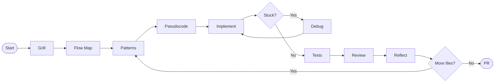

# groundup

A Claude Code framework for junior engineers who want to actually get better — not just ship features.

groundup makes Claude act as a senior engineer mentor who refuses to do the thinking for you. It enforces a structured workflow that builds real engineering skills: system design, debugging, pattern recognition, and code review.

> The feature is a vehicle. The goal is the engineer who can build the next one independently.

---

## What It Does

Every session follows a deliberate sequence:



**Grill** — Before any code, Claude interviews you relentlessly until you can state the approach, the affected files, and the key edge cases. One question at a time. No answer given until you've reasoned through it.

**Flow Map** — You draw the data flow. Claude interrogates it: transaction boundaries, failure modes, ownership, synchronous vs async. Both of you sign off on the diagram before any file is touched.

**Patterns** — Before you commit to a design or write a function, Claude checks: does this step have a known industry pattern? If yes, you learn it now — not in code review after you've already implemented something else.

**Pseudocode** — Claude writes the pseudocode directly into the file. Problem-domain language, not code. You have to think about how to translate it. That translation is where the skill gets built.

**Implement** — You write the code. Syntax help only if you ask, and only one targeted example.

**Debug** — When you're stuck, Claude doesn't suggest fixes. It walks you through: reproduce → hypothesise → instrument → verify. No fix without a stated root cause.

**Review** — Per-file code review once tests exist. Edge cases from the pseudocode header must be covered.

**Reflect** — One targeted question after each file. Not a quiz — a question that builds the instinct for next time. Claude doesn't give the answer.

---

## Install

```bash
git clone https://github.com/Osireg17/groundup
cd groundup
bash install.sh
```

That's it. Open Claude Code in any project and start describing what you want to build.

**Requirements:** Claude Code (CLI or IDE extension)

**Optional:** [GSD](https://github.com/gsd-build/get-shit-done) — if installed, groundup integrates with `/gsd-ship` for final review and PR creation.

---

## Update

After a `git pull`, re-copy skills and the hook without touching your `CLAUDE.md`:

```bash
bash update.sh
```

To also update the `CLAUDE.md` block, run `install.sh` instead — it will replace the existing groundup block safely.

---

## Uninstall

```bash
bash uninstall.sh
```

Removes skills, hook, and the groundup block from `~/.claude/CLAUDE.md`.

---

## How It Works

groundup installs into `~/.claude/`:

- **Skills** — invokable via Claude Code's Skill tool: `grill`, `flow-map`, `pseudocode`, `systematic-debugging`, `patterns`, `growth-review`
- **Bootstrap** — a session-start hook that loads the `using-groundup` skill at the start of every session
- **CLAUDE.md block** — appended to your existing `~/.claude/CLAUDE.md`, defining the mentor persona and engagement rules

Skills are triggered automatically (with a nudge, not a hard block) when a gate is bypassed. They can also be invoked manually.

---

## The Approach

groundup doesn't hard-block you. If you skip the grill or skip the flow map, Claude names the skip and the risk, then continues. The skip is itself a learning moment.

This is a deliberate choice. Engineers who learn to recognise *when* to invoke the process — not just follow it — develop better judgment than engineers who are forced through gates they don't understand.

---

## File Structure

```
groundup/
├── CLAUDE.md                        # Mentor persona (appended to ~/.claude/CLAUDE.md)
├── PHILOSOPHY.md                    # Why this framework exists
├── install.sh                       # One-command install
├── update.sh                        # Re-copy skills + hook after git pull
├── uninstall.sh                     # Clean uninstall
│
├── skills/
│   ├── using-groundup/SKILL.md      # Bootstrap: skill map, iron laws, trigger rules
│   ├── grill/SKILL.md               # Design interview
│   ├── flow-map/SKILL.md            # Data flow discussion
│   ├── pseudocode/SKILL.md          # Problem-domain pseudocode in file
│   ├── systematic-debugging/SKILL.md # Root cause first
│   ├── patterns/SKILL.md            # Contextual pattern teaching
│   └── growth-review/SKILL.md       # Post-review reflection
│
├── hooks/
│   └── session-start                # Bootstrap injection hook
│
└── docs/
    ├── workflow.md                  # Full session flow diagram
    ├── junior-traps.md              # Common growth-stunting patterns
    └── patterns-library.md         # Growing reference of industry patterns
```

---

## Contributing

Contributions that fit the mission: new patterns for `patterns-library.md`, improvements to the Grill probes, tightening the pseudocode abstraction rules, or new junior-traps entries drawn from real sessions.

groundup is a teaching tool. Every contribution should make the engineer think harder, not less.

---

## Inspired By

- [obra/superpowers](https://github.com/obra/superpowers) — iron-law-enforced development skills for AI agents
- [gsd-build/get-shit-done](https://github.com/gsd-build/get-shit-done) — structured multi-agent orchestration
- [Fission-AI/OpenSpec](https://github.com/Fission-AI/OpenSpec) — mutual agreement before implementation
- Dr. John Dalbey's [Pseudocode Standard](https://users.csc.calpoly.edu/~jdalbey/SWE/pdl_std.html) — problem-domain abstraction
