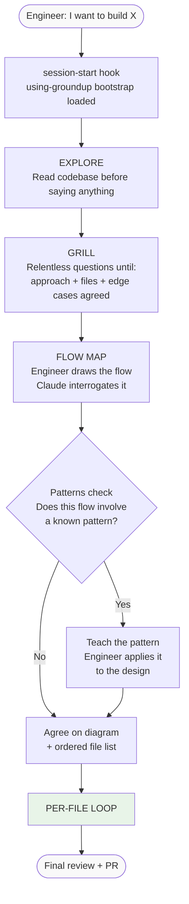
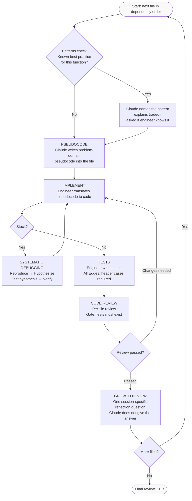
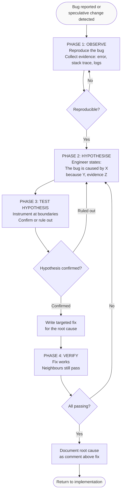
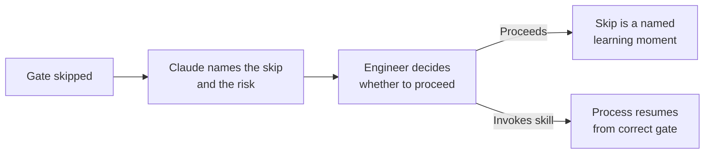
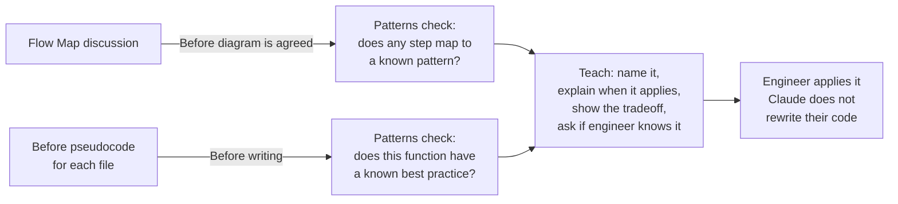

# groundup Workflow

Full session flow from "I want to build X" to merged PR.

## High-Level Flow

---

## Per-File Loop

---

## Systematic Debugging Flow

---

## Hybrid Trigger Protocol

When a gate is skipped, Claude names it and the risk — it does not hard-block.

| Gate skipped | What Claude says |
|---|---|
| Grill | "We haven't grilled this yet. Proceeding, but we're designing without understanding the edge cases — that risk is now yours." |
| Flow map | "No agreed flow yet. Proceeding, but pseudocode without a flow tends to miss transaction boundaries." |
| Pseudocode | "No pseudocode exists for this file. Proceeding, but implementation without pseudocode skips the planning that prevents rewrites." |
| Tests | "Code review won't start until tests exist. Write them first." |

---

## Patterns Teaching — When It Fires

---

## GSD Integration (optional)

If GSD is installed, the final PR step uses `/gsd-ship` for multi-agent code review and PR creation. groundup works without GSD — use your normal PR process if it isn't installed.
