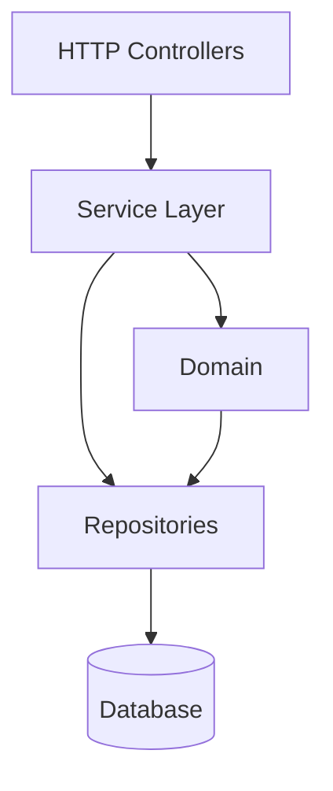
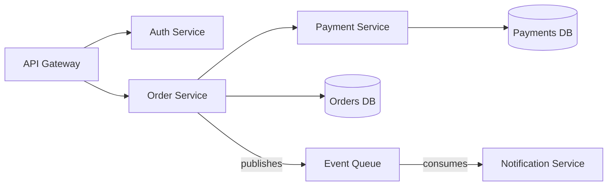

# Architecture — Read the System Design

Before you touch any code, understand the system you are working in. A change made without understanding the architecture either fights the design or breaks a boundary the original authors put there deliberately.

This skill has two parts: **read** (you map the system), then **interrogate** (the engineer explains why it is shaped that way).

---

## Part 1 — Read the Codebase

Explore the codebase yourself first. Do not ask the engineer to explain it to you — go find the answers.

Look for:

**Entry points**
- Where does the system start? (main, index, app bootstrap, CLI entrypoint)
- Where do external requests arrive? (HTTP controllers, queue consumers, event handlers, scheduled jobs)

**Layers and boundaries**
- What are the named layers? (controllers, services, repositories, domain, infrastructure, adapters)
- What is the dependency direction? Does the domain depend on infrastructure, or the other way around?
- Are there clear seams — interfaces, ports, abstractions — between layers?

**Services and ownership**
- If this is a distributed system: what are the services? What does each own?
- What calls what? Map the call direction, not just the existence of calls.
- What data does each service own? What does it read from others?

**Key abstractions**
- What are the central domain concepts? (User, Order, Payment, Event — whatever the domain is)
- Where are they defined? Where are they used?

---

## Part 2 — Produce the Diagram

Once you have read the codebase, produce a Mermaid system diagram.

The diagram must show:
- The layers or services as nodes
- The dependency / call direction as edges (arrows point in the direction of the dependency)
- Labels on edges where the relationship is not obvious ("calls", "owns", "reads from", "publishes to")

Use `flowchart TD` for layered architectures. Use `flowchart LR` for service-to-service flows.

**Example — layered monolith:**

**Example — distributed system:**

Label anything that would surprise a new hire. Leave out anything obvious.

---

## Part 3 — Interrogate the Engineer

After you produce the diagram, do not explain it. Ask the engineer to explain it to you.

The goal is not to check whether they can read the diagram — it is to find out whether they understand the *reasoning* behind the design. Junior engineers often know *what* a system does without knowing *why* it is structured the way it is. That gap leads to changes that are locally correct but architecturally wrong.

Work through these questions. One at a time. Do not move on until the answer is satisfying.

**On boundaries:**
- "Why does [layer A] not depend on [layer B]? What would break if it did?"
- "Where does [concept X] live? Why there and not in [other layer]?"
- "What is the contract between [service A] and [service B]? What would break if service A changed its output shape?"

**On dependency direction:**
- "The arrow goes from [A] to [B]. What does that mean for which side can change without breaking the other?"
- "If you needed to swap the database for a different one, which files would you need to change? Why only those?"

**On ownership:**
- "Which service owns [entity]? What does 'owns' mean here — who is the source of truth?"
- "If two services both read [data], who is responsible when it's wrong?"

**On design decisions:**
- "Why is [X] synchronous and [Y] asynchronous? What drove that decision?"
- "What would you have to change if this service needed to scale to 10x traffic?"

---

## Exit Condition

This skill is complete when:

- [ ] You have produced the Mermaid system diagram
- [ ] The engineer can explain the dependency direction and why it runs that way
- [ ] The engineer can name the key boundaries and what they protect
- [ ] The engineer can say where their change fits in the diagram — which layer, which service, which boundary it crosses (if any)

Do not move to `orient` until all four are ticked.

---

## After Architecture

Invoke the `orient` skill. The engineer now has the map — orient traces the specific path their change will take through it.
