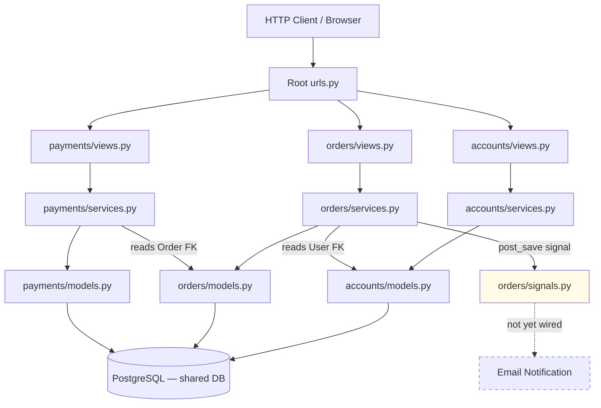

# Architecture Skill Response — Django Email Notification

## Part 1 — Reading the Codebase

Before touching anything, I mapped the system myself.

**Entry points:** Django's URL routing (`urls.py` at project root and per-app) is where HTTP requests land. Each app registers its own URL patterns included by the root router.

**Django apps:**
- `accounts/` — user management (registration, login, profiles). Models: `User`, `Profile`
- `orders/` — order lifecycle (create, update, ship, cancel). Models: `Order`, `OrderItem`, `OrderStatus`. Notable: `signals.py` exists as an internal event seam
- `payments/` — payment processing (charge, refund). Models: `Payment`, `PaymentStatus`, `Refund`

**Cross-app relationships:**
- `orders` references `accounts` via User FK (an Order belongs to a User)
- `payments` references `orders` via Order FK (a Payment belongs to an Order)
- No dedicated notifications app exists yet

**Infrastructure:** Django ORM -> PostgreSQL (single shared DB). No Celery, no Redis, no message queue visible. `django.core.mail` is the available email mechanism.

---

## Part 2 — System Diagram

**Key observations:**
- All three apps share one database — no service boundaries, only app boundaries within the monolith
- Dependency direction: views -> services -> models -> DB
- `orders` depends on `accounts`; `payments` depends on `orders` — one-way chain
- `orders/signals.py` is the existing seam for post-save side effects — the natural insertion point for email
- The dashed node is what your ticket asks you to add

---

Walk me through this — explain what you see.

---

*(After the engineer responds, interrogation begins one question at a time, drawn from: boundaries, dependency direction, ownership, and async vs sync design decisions — adjusted based on what they say.)*
