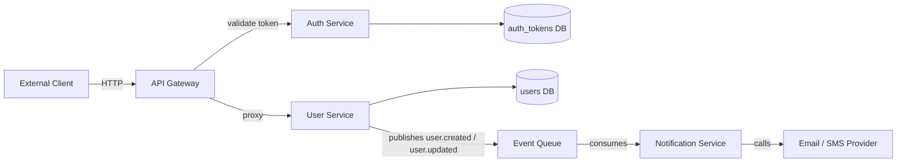

# Architecture Skill Response — Microservices Rate Limiting

## Simulated codebase read

- `api-gateway` owns all inbound HTTP traffic; routes + auth middleware
- `auth-service` owns token issuance and validation, has its own DB
- `user-service` owns user records, has its own DB, publishes events on changes
- `notification-service` consumes from an event queue, calls external email/SMS — no inbound REST

## Diagram

Walk me through this — explain what you see.

---

*(First interrogation question, after engineer responds: "The API Gateway talks to both auth-service and user-service — what is its job exactly? Is it a service, or something different? What would break if a client bypassed it and called user-service directly?")*

*(Interrogation continues one question per turn until the engineer can answer all three exit conditions: dependency direction + why, key boundaries + what each protects, and where rate limiting fits in this diagram.)*
