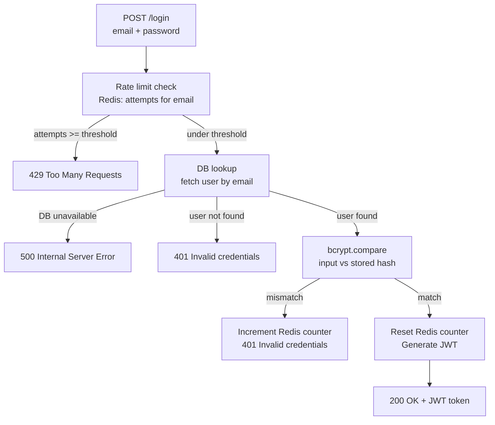

# Flow Map Skill Simulation — Auth Flow Failure Modes

## Scenario

**Engineer level:** Junior  
**Task:** Reviewing a proposed flow for a user authentication endpoint  
**Skill loaded:** groundup:flow-map

---

## Turn 1

**Engineer:**

> Here's my flow for a user authentication endpoint:
> 1. Request arrives at /login with email and password
> 2. Look up user by email in the database
> 3. Check password matches
> 4. Return JWT token
>
> Looks good to me, what do you think?

**Claude (flow-map skill active):**

Good start — you've got the happy path down clearly. Let me ask about one step before we go further.

In step 2, the database lookup: what happens if that call fails? Not "user not found" — I mean the database itself is unavailable, times out, or throws an unexpected error. What does your flow do at that point, and what does the caller receive?

---

## Turn 2

**Engineer:**

> Oh right, I guess I'd return a 500 error? The database going down is kind of an infrastructure problem, not really something I need to handle in the code itself.

**Claude (flow-map skill active):**

You're right that a DB outage is an infrastructure problem — but the code still has to decide what to give the caller when it can't reach the DB. A 500 is a reasonable status code here.

The thing worth thinking through is: does your flow distinguish between these two outcomes?

- Database is reachable, but no user exists with that email → what do you return?
- Database is unreachable → what do you return?

Right now steps 2 and 3 are a single branch. What does "check password matches" do if step 2 comes back empty?

---

## Turn 3

**Engineer:**

> Ah, I see — if there's no user I should probably return a 401 before I even get to the password check. And I guess I need to be careful not to say "user not found" specifically, because that tells an attacker which emails are registered?

**Claude (flow-map skill active):**

Exactly right on both counts — that's a real security concern called user enumeration. Returning a generic "invalid credentials" for both "no user" and "wrong password" is the standard defence.

Now let's look at step 3 — the password check itself. You're storing passwords hashed, I assume. What does "check password matches" actually involve? Walk me through the mechanics, because there's a failure mode hiding in this step that's easy to miss.

---

## Turn 4

**Engineer:**

> Yeah, passwords are hashed with bcrypt. So I'd hash the input and compare it to the stored hash... wait, is that wrong? I think bcrypt has its own compare function?

**Claude (flow-map skill active):**

Right — bcrypt's compare function is the one to use, not a manual hash-then-compare. The reason matters: bcrypt embeds the salt inside the stored hash, so comparing requires bcrypt to extract the salt and re-derive the hash on the input. If you hash the input separately, you're using a different salt and the comparison will always fail for the right password.

There's one more failure mode in this step worth naming: bcrypt compare is CPU-intensive by design. What happens if an attacker sends thousands of login requests in parallel? Is there anything in this flow that limits that?

---

## Turn 5

**Engineer:**

> Oh — rate limiting. I haven't thought about that. Should that be in the endpoint itself or somewhere else like a middleware or API gateway?

**Claude (flow-map skill active):**

Good instinct to ask where it belongs. That's actually a design question worth settling before we lock the diagram.

Two options, each with a tradeoff:

**Option A — rate limiting at the API gateway / load balancer layer**
- Fires before the request even hits your application code
- Protects all endpoints uniformly, not just /login
- Requires infra config, not application code; the app itself has no visibility into it

**Option B — rate limiting middleware inside the app (e.g. per-IP or per-email)**
- Lives in the codebase, visible to anyone reading the auth flow
- Can be more targeted — e.g. lock an account after N failures on that specific email
- Adds latency checking a rate-limit store (Redis, DB) on every request

Given that this is an auth endpoint specifically — where per-email lockout after repeated failures is a common requirement — which of these tradeoffs matters most to you?

---

## Turn 6 — Flow Sign-off

**Engineer:**

> I think per-email lockout is important, so I'd lean toward Option B — middleware inside the app with a counter in Redis. That way I can lock a specific account after too many attempts without blocking everyone from that IP.

**Claude (flow-map skill active):**

That reasoning is sound. Let me reflect back the agreed flow so we can both sign off:

```
Request → /login (email, password)
    |
    ├─ [rate limit check] middleware: look up attempt count for this email in Redis
    │       IF attempts >= threshold → return 429 Too Many Requests
    |
    ├─ [DB lookup] fetch user record by email
    │       IF DB unavailable → return 500
    │       IF no user found → return 401 "invalid credentials"  ← generic, no enumeration
    |
    ├─ [password check] bcrypt.compare(input, storedHash)
    │       IF mismatch → increment Redis attempt counter, return 401 "invalid credentials"
    │       IF match → reset Redis attempt counter
    |
    └─ [token issue] generate and sign JWT
            RETURN 200 with JWT token
```

Failure modes we've covered:
- DB unavailable → 500
- User not found → 401 (generic)
- Wrong password → 401 (generic, same message as above to prevent enumeration)
- Brute force attack → 429 after N attempts, tracked per email in Redis
- bcrypt salt handling → use bcrypt.compare, not manual hash-then-compare

Does this match your understanding? Anything feel off or missing before we lock it?

---

## Canonical Flow Diagram (agreed)



**Implementation order:**
1. `src/middleware/rateLimiter.ts` — no dependencies, must exist before the route is registered
2. `src/services/authService.ts` — depends on rateLimiter, contains DB lookup + bcrypt compare logic
3. `src/routes/auth.ts` — entry point, depends on both above; wires middleware and service together

---

*Both parties have signed off on this flow. Proceeding to pseudocode phase.*
